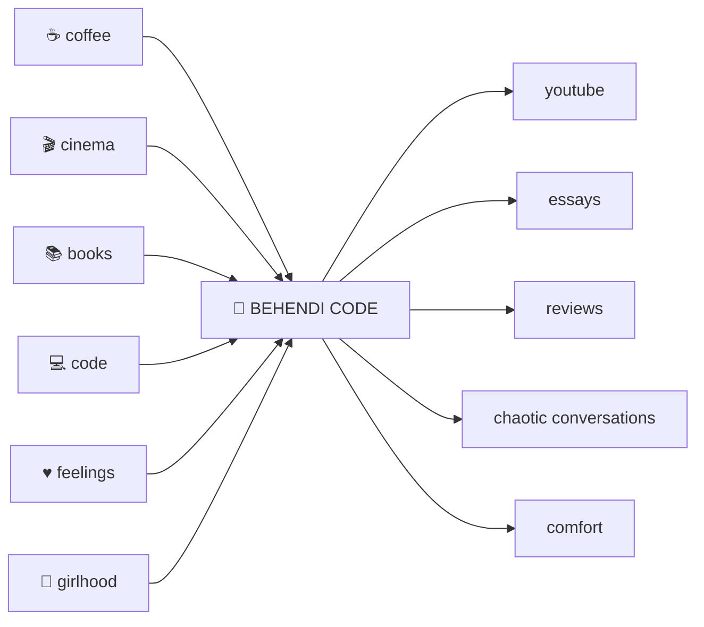

<!-- =========================================================
     BEHENDI CODE
     cinema • code • coffee • chaos • conversations
     ========================================================= -->

<div align="center">


<br>


<br><br>

<table>
<tr>
<td align="center"><b>🎬 MOVIES</b></td>
<td align="center"><b>☕ COFFEE</b></td>
<td align="center"><b>💻 CODE</b></td>
<td align="center"><b>📚 BOOKS</b></td>
<td align="center"><b>♥ FEELINGS</b></td>
<td align="center"><b>💋 NONSENSE</b></td>
</tr>
</table>

<br>

<code>EST. SOMEWHERE BETWEEN A DEADLINE AND A COFFEE BREAK</code>

</div>

<br>

<!-- ═══════════════════════════════════════════════════════════ -->

# 💋 `episode today: behendi code.`

> **not a productivity channel. not a movie channel. not a coding channel.**
>
> somehow, unfortunately, all three.

**Behendi Code** is the digital extension of our YouTube corner of the internet.

Sometimes there are two of us.

Sometimes it's just one girl, one laptop, one coffee, and several opinions nobody requested.

We talk about **movies we can't stop thinking about, books that emotionally damaged us, academics we're pretending are under control, code, college, friendship, growing up, feelings, comfort shows, random obsessions, and whatever else hijacked the group chat that week.**

Basically:

```txt
         ┌──────────────────────────────────┐
         │                                  │
         │       B E H E N D I  C O D E     │
         │                                  │
         │   ✦ code      ✦ cinema           │
         │   ✦ books     ✦ chai/coffee      │
         │   ✦ college   ✦ girlhood         │
         │   ✦ feelings  ✦ bad decisions    │
         │                                  │
         │      [ GOOD VIBES MOSTLY ]       │
         │                                  │
         └──────────────────────────────────┘
```

---

<div align="center">

## `✦ GOOD DRAMA. GREAT STORIES. ✦`


</div>

---

# 🎬 `THE PLOT`



---

# 🎀 `PICK YOUR POISON`

<table>
<tr>
<td width="50%" valign="top">

### 🎬 MOVIE NIGHTS

The movie was two hours.

The conversation about it?

**Three business days.**

Reviews, comfort films, terrible endings, characters we defend like lawyers, characters we would personally fight, iconic scenes and unsolicited analysis.

> *"I understood the movie. I simply disagree with it."*

</td>
<td width="50%" valign="top">

### 📚 BOOKS & EMOTIONAL DAMAGE

Books we loved.

Books we hated.

Books we bought because the cover was pretty.

Books that permanently altered our brain chemistry.

> *"five stars. ruined my week."*

</td>
</tr>

<tr>
<td width="50%" valign="top">

### 💻 CODE & ACADEMIC SURVIVAL

Coding.

Projects.

College.

Exams.

Things we learned five minutes before needing them.

Occasionally educational.

Frequently accompanied by caffeine.

> *"works on my laptop. don't ask further questions."*

</td>
<td width="50%" valign="top">

### ♥ GIRL TALK

Friendships.

Confidence.

Growing up.

Feeling lost.

Feeling unstoppable approximately twelve minutes later.

Sometimes there isn't a lesson.

Sometimes you just need someone to say:

> *"girl. SAME."*

</td>
</tr>
</table>

---

<div align="center">

### ────── ⋆⋅☆⋅⋆ ──────

# `YOU DON'T KNOW WHAT I KNOW.`

### ────── ⋆⋅☆⋅⋆ ──────

</div>

# 📼 `NOW PLAYING`

```txt
╔══════════════════════════════════════════════════════════════╗
║                                                              ║
║  BEHENDI CODE RADIO                              ● LIVE      ║
║                                                              ║
║  ♫  main character energy                                   ║
║                                                              ║
║  01:47  ━━━━━━━━━━━●━━━━━━━━━━━━━━━━━━━━  04:12              ║
║                                                              ║
║              ◀◀        ▶        ▶▶                           ║
║                                                              ║
║  UP NEXT                                                     ║
║  ├─ bad decisions (acoustic)                                 ║
║  ├─ deadline at 11:59                                        ║
║  ├─ one more episode                                         ║
║  └─ we'll figure it out                                      ║
║                                                              ║
╚══════════════════════════════════════════════════════════════╝
```

---

# ☕ `THE BEHENDI FORMULA`

```python
class BehendiCode:

    def __init__(self):
        self.coffee = float("inf")
        self.opinions = float("inf")
        self.sleep = None

        self.current_obsessions = [
            "movies",
            "books",
            "code",
            "music",
            "girlhood",
            "academics",
            "random internet rabbit holes"
        ]

    def make_episode(self):
        topic = choose_whatever_we_are_obsessed_with()

        research(topic)
        overthink(topic)

        conversation = talk_for_way_too_long(topic)

        return edit_until_it_looks_pretty(conversation)


behendi = BehendiCode()

while not world_ends():
    behendi.make_episode()
```

---

# 💌 `MEET THE CHAOS DEPARTMENT`

<table>
<tr>

<td align="center" width="50%">

## 🖤 THE CHECKERED GIRL

`CODE / CINEMA / CHAOS`

💻 builds things  
🎬 has opinions  
☕ caffeine dependent  
📚 probably reading  
🖤 professionally overthinking

**current status**

`main character until further notice`

</td>

<td align="center" width="50%">

## 💗 THE OTHER HALF

`STORIES / DRAMA / VIBES`

🎀 brings the lore  
🎥 movie-night department  
💬 says what everyone was thinking  
📖 collector of stories  
💗 enables the chaos

**current status**

`plot twist loading...`

</td>

</tr>
</table>

<div align="center">

### `sometimes together. sometimes solo. always behendi.`

</div>

---

# 📓 `BEHENDI'S LITTLE BLACK BOOK`

| FILE | CONTENTS | STATUS |
|:---|:---|:---:|
| `movies.exe` | cinema, reviews & unnecessary character analysis | 🎬 ACTIVE |
| `books.md` | recommendations & emotional casualties | 📚 OPEN |
| `code.py` | projects, academics & technical chaos | 💻 RUNNING |
| `girlhood.txt` | friendship, confidence & growing pains | 💗 CLASSIFIED |
| `coffee.json` | caffeine infrastructure | ☕ CRITICAL |
| `opinions.db` | things absolutely nobody asked us | 💋 OVERFLOWING |

---

# 🎞️ `EPISODE BOARD`

```txt
┌────────────────────────┐   ┌────────────────────────┐
│       MOVIE NIGHT      │   │      STUDY CRISIS      │
│                        │   │                        │
│    🍿  🎬  💋          │   │     ☕  💻  📚         │
│                        │   │                        │
│ "that ending was       │   │ "the exam is          │
│  PERSONAL."            │   │  tomorrow??"           │
└────────────────────────┘   └────────────────────────┘


┌────────────────────────┐   ┌────────────────────────┐
│       GIRL TALK        │   │      BOOK CLUB         │
│                        │   │                        │
│     🎀  ♥  ☕           │   │     📖  ☕  🖤         │
│                        │   │                        │
│ "we need to discuss    │   │ "this fictional man   │
│  what happened."       │   │  has ruined reality." │
└────────────────────────┘   └────────────────────────┘
```

---

<div align="center">

# 🎀 `BEHENDI CORE`

| ✦ | ✦ | ✦ |
|:---:|:---:|:---:|
| **PINK** | **BLACK** | **CREAM** |
| `#FF4F91` | `#080808` | `#F7D6B5` |
| 💋 | 🖤 | ☕ |

</div>

---

# 🪩 `THE WEBSITE`

The website isn't supposed to be a boring companion page.

Think of it as the **Behendi bedroom wall turned into a website.**

```txt
BEHENDI CODE
│
├── 🎬 WATCH
│     ├── latest episodes
│     ├── movie nights
│     └── video essays
│
├── 📚 READ
│     ├── books
│     ├── reviews
│     ├── thoughts
│     └── recommendations
│
├── 💻 CODE
│     ├── projects
│     ├── academics
│     └── things we're learning
│
├── ☕ AFTER HOURS
│     ├── girl talk
│     ├── life
│     ├── feelings
│     └── unsolicited opinions
│
└── 💌 US
      ├── about
      ├── socials
      └── contact
```

---

# 💻 `BEHIND THE PRETTY THINGS`

<div align="center">


</div>

---

# 🎬 `PRODUCTION STATUS`

```txt
PROD.      BEHENDI CODE
─────────────────────────────────────────
SCENE      building something pretty
TAKE       ∞
DIRECTOR   questionable
COFFEE     yes
BUDGET     don't ask
DEADLINE   yesterday
STATUS     ███████████████░░░  iconic-ish
─────────────────────────────────────────
```

---

# 💭 `THINGS SAID FIVE MINUTES BEFORE DISASTER`

<div align="center">

> ### *"how hard could it be?"*

&nbsp;

> ### *"one episode and then we'll study."*

&nbsp;

> ### *"I don't need to write this down. I'll remember."*

&nbsp;

> ### *"I'll fix the code later."*

&nbsp;

> ### *"no, no. hear me out."*

</div>

---

# 🖤 `MANIFESTO`

We don't want the internet to feel like another place where everyone has everything figured out.

Behendi Code is allowed to be **smart without pretending to be serious all the time.**

We can talk about algorithms today and a terrible rom-com tomorrow.

We can review a book, complain about college, build something, talk about friendship, obsess over a movie scene and then disappear for coffee.

There doesn't always need to be a niche.

Sometimes **the personality is the niche.**

---

<div align="center">


<br>

### `BEHENDI CODE © 2026`

**made somewhere between a coffee break and an existential crisis.**

`[ MOVIE NIGHTS ]`　`[ K-DRAMAS ]`　`[ BOOKS ]`　`[ CODE ]`　`[ GIRL TALK ]`

<br>


</div>
